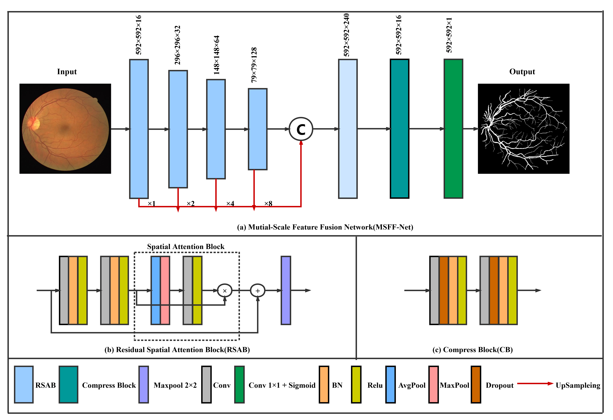

# An-Lightweight-Multi-Scale-Feature-Fusion-Network-LMSFF-Net

文章地址

  知网搜索 视网膜血管分割方法的研究 作者 赵文 学校 黑龙江大学
  
  此代码为大论文第五章算法的代码和模型

模型地址：
  百度云地址：https://pan.baidu.com/s/1QBKOeV4UOcNGTpLwKCbIsw
  提取码：msff
